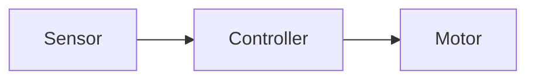

# 内容上传与维护用户手册

> 版本：v0.6
> 日期：2026-07-29
> 适用对象：以后维护这个网站内容的人，也就是你自己。  
> 目标：不用改代码，也能清楚地新增文档、上传项目、添加图片、实时预览和发布网站。

---

## 1. 先记住一句话

以后维护网站内容，主要改这两个地方：

```text
docs-vitepress/       写文档、项目、个人分享
public/images/        放图片、封面、截图、背景素材
public/videos/        放小视频、演示录屏
```

一般不要直接改：

```text
src/content/*.ts
```

因为现在网页已经会自动扫描 `docs-vitepress` 里的 Markdown 文件。你新增 `.md` 文件后，只要格式正确，就会自动进入网页数据源。

---

## 2. 本地实时预览

### 2.1 启动网页

在项目根目录运行：

```bash
npm run dev
```

浏览器打开：

```text
http://127.0.0.1:5173/embedded-blog/
```

如果端口不是 5173，以终端里 Vite 输出的地址为准。

### 2.2 什么叫实时更新

本地开发时：

- 你修改 Markdown 文件。
- 保存文件。
- 浏览器会自动刷新或热更新。
- 列表和详情页会读取最新内容。

也就是说，本地预览基本是实时的。

### 2.3 启动 Content Studio

本地内容工作台使用单独命令启动：

```bash
npm run studio
```

浏览器打开：

```text
http://127.0.0.1:4174/
```

当前 v0.4 工作台已经支持：

- 扫描技术文档、项目和个人分享。
- 按内容类型、状态和关键词筛选。
- 在 GUI 里新建技术文档、项目作品和个人分享草稿。
- 编辑标题、摘要、状态、分类、标签、项目阶段、图集等常用字段。
- 编辑 Markdown 正文，并实时查看详情预览。
- 上传图片、GIF、SVG 和 MP4/WebM 小视频。
- 一键把素材插入正文，项目图片还可以加入 `gallery`。
- 复用主站 Markdown 渲染器进行详情预览。
- 查看草稿、归档和缺失字段等基础检查。
- 显式保存到磁盘 Markdown 文件。
- 保存前自动做浏览器草稿备份，刷新后可以恢复未保存内容。
- 写入磁盘前创建本地备份，遇到其他窗口已经改过同一文件时会拒绝覆盖。

工作台顶部会显示“可编辑”。只要保存按钮变亮，就说明当前内容和磁盘文件不一致；点击“保存”后才会真正写回 `docs-vitepress` 下的 Markdown 文件。

### 2.4 Content Studio 怎么保存

推荐用法：

1. 在左侧选择内容。
2. 在中间修改字段或 Markdown 正文。
3. 右侧确认预览和检查结果。
4. 点击顶部“保存”。
5. 回到主站本地预览确认页面效果。

保存时系统会做三件事：

- 先把原始 Markdown 复制到 `tools/content-studio/.backups/`。
- 再写入临时文件。
- 最后用临时文件替换原文件，避免写到一半损坏正文。

如果你同时用 VS Code 或另一个 Studio 窗口改了同一篇内容，保存时可能看到冲突提示。这时先刷新 Studio，确认磁盘上的新版本，再决定是否重新套用自己的修改。

### 2.5 在 Content Studio 新建内容

点击顶部“新建”，选择内容类型：

- 技术文档：写入 `docs-vitepress/docs/`，素材目录是 `public/images/docs/{id}/`。
- 项目作品：写入 `docs-vitepress/projects/`，素材目录是 `public/images/projects/{id}/`。
- 个人分享：写入 `docs-vitepress/life/`，素材目录是 `public/images/life/{id}/`。

新建时至少填写：

- `title`：标题。
- `id`：文件名和路由标识，只能用小写英文、数字和连字符。
- `summary`：卡片摘要。

标题会自动生成一个建议 ID。如果标题是中文，建议手动把 ID 改成稳定英文，例如：

```text
motor-debug-notes
smart-car-v2
desk-upgrade-2026
```

创建成功后，Studio 会自动打开新草稿。此时内容已经写入磁盘，后续修改仍然需要点击“保存”。

### 2.6 在 Content Studio 上传和插入素材

选择一篇内容后，右侧切到“素材”标签页。

可以上传：

- 图片：`jpg`、`jpeg`、`png`、`webp`、`avif`、`svg`。
- 动图：`gif`。
- 小视频：`mp4`、`webm`。

大小限制：

- 图片和 GIF：单个文件不超过 15 MB。
- 小视频：单个文件不超过 30 MB。

上传后系统会自动规范文件名：

```text
Circuit Diagram.PNG  ->  circuit-diagram.png
Offline Recovery Demo.mp4  ->  offline-recovery-demo.mp4
```

同名文件不会覆盖旧文件，会自动追加 `-2`、`-3` 这样的后缀。

素材目录规则：

```text
public/images/docs/{id}/
public/images/projects/{id}/
public/images/life/{id}/
public/videos/docs/{id}/
public/videos/projects/{id}/
public/videos/life/{id}/
```

点“插入正文”后：

- 图片/GIF/SVG 会插入标准 Markdown 图片语法。
- MP4/WebM 会插入 `video` 富内容块。

点“加入图集”后：

- 只有项目图片会显示这个按钮。
- 图片路径会加入项目 frontmatter 的 `gallery`。

注意：插入正文或加入图集后，只是进入浏览器草稿状态。你仍然需要点击顶部“保存”，才会写回 Markdown 文件。

### 2.7 浏览器草稿和磁盘保存的区别

浏览器草稿只是防止刷新、关闭页面时丢失未保存内容；它保存在浏览器 `localStorage` 里，不会进入 Git，也不会上线。

磁盘保存才会修改真实 Markdown 文件。保存成功后，浏览器草稿会自动清理。

如果重新打开某篇内容时看到“发现浏览器草稿”，说明上一次有未保存修改。你可以：

- 点“恢复”：把浏览器草稿放回编辑器，然后再手动保存。
- 点“丢弃”：删除这份浏览器草稿，继续使用磁盘版本。

### 2.8 哪些情况仍建议直接改 Markdown

目前工作台优先覆盖高频字段和正文维护。以下情况仍建议直接在编辑器里改 Markdown：

- 复杂 `links` 结构。
- 大段富内容块的 YAML 配置。
- 一次性批量重命名或移动多篇内容。
- 需要精细控制 frontmatter 字段顺序的情况。

这些直接修改仍然安全，因为网站的唯一内容源还是普通 Markdown 文件，工作台只是更好用的维护入口。

线上网站不是自动实时更新。线上更新需要：

1. 本地改内容。
2. 本地预览确认。
3. 构建。
4. 部署到 Pages。

---

## 3. 内容类型和目录

网站内容分三类：

| 类型 | 写在哪里 | 图片放哪里 | 网页用途 |
| --- | --- | --- | --- |
| 技术文档 | `docs-vitepress/docs/` | `public/images/docs/` | 知识库沉淀 |
| 项目作品 | `docs-vitepress/projects/` | `public/images/projects/` | 项目展示 |
| 个人分享 | `docs-vitepress/life/` | `public/images/life/` | 生活、摄影、个人风采 |

网站背景、头像和公共素材放：

```text
public/images/site/
public/images/profile/
public/images/playground/
```

---

## 4. 新增技术文档

### 4.1 用命令创建草稿

```bash
npm run new:doc -- "FreeRTOS Task Notes" freertos-task-notes
```

这会自动创建：

```text
docs-vitepress/docs/freertos-task-notes.md
public/images/docs/freertos-task-notes/
```

如果不写最后的 `id`，系统会根据标题自动生成：

```bash
npm run new:doc -- "FreeRTOS Task Notes"
```

### 4.2 编辑文档信息

打开新生成的 `.md` 文件，你会看到类似：

```yaml
---
id: freertos-task-notes
title: FreeRTOS Task Notes
category: Notes
tags:
  - Embedded
level: beginner
createdAt: '2026-06-03'
updatedAt: '2026-06-03'
readingTime: 5 min
views: 0
summary: Write a short summary for this document.
cover: /images/docs/freertos-task-notes/cover.jpg
status: draft
---
```

你需要重点改：

- `title`：文档标题。
- `category`：分类，比如 `Embedded`、`System Design`、`Frontend`。
- `tags`：标签，可以多个。
- `level`：难度，使用 `beginner`、`intermediate`、`advanced`。
- `updatedAt`：更新时间。
- `summary`：卡片摘要。
- `status`：发布状态。

### 4.3 文档发布状态

建议使用：

```yaml
status: draft
```

表示草稿。

```yaml
status: published
```

表示正式内容。

```yaml
status: archived
```

表示归档内容，不进入网页列表。

当前规则已经固定：

- 本地 `npm run dev`：显示 `draft` 和 `published`，方便预览。
- 生产 `npm run build`：只包含 `published`。
- `archived`：本地和生产都不显示，但文件仍保留。

因此新建内容可以一直保持 `draft`，确认完成后再改成 `published`。

### 4.4 写正文

frontmatter 下面就是正文：

```markdown
# FreeRTOS Task Notes

## Background

这里写背景。

## Key Points

- 要点 1
- 要点 2

## Details

这里写正文。
```

保存后，本地浏览器会自动更新。

---

## 5. 新增项目作品

### 5.1 用命令创建项目草稿

```bash
npm run new:project -- "Smart Car" smart-car
```

这会创建：

```text
docs-vitepress/projects/smart-car.md
public/images/projects/smart-car/
```

### 5.2 放项目图片

把项目图片放进：

```text
public/images/projects/smart-car/
```

建议命名：

```text
cover.jpg
architecture.png
hardware.jpg
demo-01.jpg
demo-02.jpg
```

### 5.3 编辑项目 frontmatter

示例：

```yaml
---
id: smart-car
title: Smart Car
summary: A smart car project based on STM32 and PID control.
stack:
  - STM32
  - FreeRTOS
  - PID
highlights:
  - Closed-loop speed control
  - Sensor fusion
  - Real-time debugging
gallery:
  - /images/projects/smart-car/cover.jpg
  - /images/projects/smart-car/architecture.png
links:
  - label: GitHub
    href: '#'
role: Embedded Developer
period: '2026'
status: published
projectStage: maintained
---
```

`status` 表示是否发布；`projectStage` 表示项目本身处于哪个阶段，可选值：

- `concept`：概念或方案阶段。
- `building`：正在开发。
- `completed`：已经完成。
- `maintained`：完成后仍在维护。
- `paused`：暂时停止。

### 5.4 项目正文结构

项目正文建议按这个结构写：

```markdown
# Smart Car

## Project Background

为什么做这个项目。

## Goals

项目目标。

## System Architecture

系统架构，可以放架构图。


## Core Features

- 功能 1
- 功能 2
- 功能 3

## Challenges And Solutions

记录难点和解决方案。

## Results

展示成果图或演示。

## Retrospective

复盘总结。
```

### 5.5 给持续更新的项目添加时间线和报告入口

进行中的项目可以把正文拆成多个 `milestone`。网页会按顺序把它们显示成项目时间线；填写了 `document` 的节点可以直接点进测试报告或技术文档。

推荐操作顺序：

1. 在 Content Studio 点击“新建”，先创建一篇“技术文档”。
2. 给文档填写稳定的英文 ID，例如 `motor-speed-ripple-test`，保存测试条件、图表和结论。
3. 回到项目正文，在需要的位置加入一个 `milestone` 块。
4. 把文档 ID 填到 `document`，保存后回主站点击节点检查跳转。

示例：

````markdown
```milestone
date: 2026-08-03
title: 低速速度波动对照实验
status: current
media: /images/projects/motor-control/speed-ripple.webp
document: motor-speed-ripple-test
```
这一轮固定母线电压和负载，只比较编码器补偿前后的速度波动。
````

字段含义：

- `date`：节点日期，也可以写 `Next`。
- `title`：时间线里显示的节点标题。
- `status`：使用 `past`、`current` 或 `future`，分别表示已完成、正在进行和后续计划。
- `media`：可选的图片或实验素材路径。
- `document`：可选的技术文档 ID，不写时节点只展示进度，不能点击进入报告。

文档 ID 必须和 `docs-vitepress/docs/{id}.md` 里的 `id` 完全一致，只使用小写英文、数字和连字符。例如：

```text
document: foc-encoder-calibration-report
```

### 5.6 普通项目和定制视觉的边界

普通项目只需要维护 Markdown、图片和时间线，不需要制作 3D。`motor-control` 当前额外使用了一套“完整电机 -> 爆炸图 -> 时间线”的专属视觉，它不会强制其他项目套用同一种效果。

如果以后要给另一个项目做专属视觉，先把内容和报告节点按 5.5 节整理好，再单独增加视觉预设。这样即使动画关闭、移动端降级或后续更换视觉，项目资料和报告链接仍然完整可读。

电机 CAD 和序列帧的高级替换步骤见：

```text
tools/motor-story/README.md
```

---

## 6. 新增个人分享

### 6.1 用命令创建生活文章

```bash
npm run new:life -- "Desk Upgrade" desk-upgrade-2026
```

会创建：

```text
docs-vitepress/life/desk-upgrade-2026.md
public/images/life/desk-upgrade-2026/
```

### 6.2 放图片

把照片放入：

```text
public/images/life/desk-upgrade-2026/
```

建议命名：

```text
cover.jpg
photo-01.jpg
photo-02.jpg
```

### 6.3 编辑个人分享 frontmatter

```yaml
---
id: desk-upgrade-2026
title: Desk Upgrade
date: '2026-06-03'
tag: Life
summary: A small note about my workstation upgrade.
cover: /images/life/desk-upgrade-2026/cover.jpg
mood: quiet
status: published
---
```

### 6.4 正文写法

个人分享不必像技术文档那么严肃，可以这样：

```markdown
# Desk Upgrade

## Moment

今天整理了桌面。

## Photos


## Reflection

整理之后工作状态更清爽。
```

---

## 7. 上传图片和引用图片

### 7.1 图片放哪里

技术文档图片：

```text
public/images/docs/doc-id/
```

项目图片：

```text
public/images/projects/project-id/
```

个人分享图片：

```text
public/images/life/post-id/
```

头像和个人信息图片：

```text
public/images/profile/
```

网站背景：

```text
public/images/site/
```

### 7.2 Markdown 里怎么引用图片

图片放在：

```text
public/images/projects/smart-car/cover.jpg
```

Markdown 里写：

```markdown

```

注意：路径从 `/images/...` 开始，不写 `public`。

### 7.3 封面和图集怎么写

项目图集：

```yaml
gallery:
  - /images/projects/smart-car/cover.jpg
  - /images/projects/smart-car/demo-01.jpg
```

个人分享封面：

```yaml
cover: /images/life/desk-upgrade-2026/cover.jpg
```

技术文档封面：

```yaml
cover: /images/docs/freertos-task-notes/cover.jpg
```

### 7.4 图片命名建议

推荐：

```text
cover.jpg
architecture.png
demo-01.jpg
debug-log.png
photo-01.jpg
```

不推荐：

```text
微信图片_20260403091226_832_185.jpg
Snipaste_2026-04-01_05-22-07.png
新建文件副本最终版2.jpg
```

原因：以后不好找，也不方便维护。

### 7.5 GIF、视频、画廊、提示块和交互演示

GIF 和普通图片写法一致，放在 `public/images/...`：

```markdown

```

短视频放在 `public/videos/...`，正文使用结构化内容块：

````markdown
```video
src: /videos/edge-gateway/offline-recovery.mp4
poster: /images/projects/edge-gateway/video-poster.jpg
caption: 断网恢复演示
autoplay: false
loop: false
muted: false
```
````

图片画廊：

````markdown
```gallery
columns: 2
images:
  - src: /images/projects/smart-car/cover.jpg
    alt: 整车外观
    caption: 第一版整车
  - src: /images/projects/smart-car/architecture.png
    alt: 系统架构
    caption: 控制链路
```
````

提示块：

````markdown
```callout
type: warning
title: 上电前检查
content: 先确认电机电源和控制板共地。
```
````

`type` 可使用 `note`、`tip`、`warning`、`danger`。

本地交互演示放在 `public/demos/...`：

````markdown
```demo
src: /demos/pid-tuning/index.html
title: PID 调参演示
height: 520
allowFullscreen: true
```
````

演示会在受限 iframe 中运行，只允许引用 `public/demos` 下的本地页面。不要把不可信网页或脚本放进演示目录。

Mermaid 语法已经被内容核心识别：

````markdown

````

Content Studio 的“素材”标签页已经可以上传图片、GIF、SVG、MP4 和 WebM，并生成这些 Markdown 片段。Mermaid 当前仍以可读源码块展示，后续再接入真正的 SVG 图表渲染。

---

## 8. 内容检查

每次新增或修改内容后，建议运行：

```bash
npm run check:content
```

它会检查：

- Markdown 是否有 frontmatter。
- 必填字段是否缺失。
- `status` 和 `projectStage` 是否使用允许值。
- `id` 是否重复。
- 图片路径是否真的存在。
- 视频、画廊和交互演示引用的本地素材是否存在。

如果看到：

```text
Content check passed
```

说明内容结构没问题。

如果看到：

```text
image not found
```

说明你写了图片路径，但对应图片没有放到 `public/images/...`。

---

## 9. 本地预览完整流程

### 9.1 第一次启动

```bash
npm run dev
```

打开：

```text
http://127.0.0.1:5173/embedded-blog/
```

### 9.2 修改内容

例如修改：

```text
docs-vitepress/projects/smart-car.md
```

保存后浏览器会自动刷新。

### 9.3 检查内容

```bash
npm run check:content
```

### 9.4 构建检查

```bash
npm run build
```

如果构建通过，说明可以准备发布。

---

## 10. 发布到线上

当前项目是静态站，线上内容不会因为你本地保存 Markdown 就自动变化。线上发布需要部署。

### 10.1 GitHub Pages 部署

构建：

```bash
npm run build
```

部署：

```bash
npm run deploy
```

这个命令会把 `dist/` 发布到 `gh-pages`。

### 10.2 Gitee Pages 部署

构建：

```bash
npm run build
```

运行：

```powershell
.\deploy-gitee.ps1
```

脚本会把 `dist/` 推到 Gitee 的 `gh-pages` 分支。

发布后需要到 Gitee Pages 页面确认服务更新。

### 10.3 当前线上地址

```text
https://www223.gitee.io/embedded-blog/
```

---

## 11. 推荐的日常工作流

### 新增一篇文档

```bash
npm run new:doc -- "Document Title" document-id
npm run dev
npm run check:content
npm run test:content-core
npm run build
```

### 新增一个项目

```bash
npm run new:project -- "Project Title" project-id
npm run dev
npm run check:content
npm run test:content-core
npm run build
```

### 新增一篇个人分享

```bash
npm run new:life -- "Post Title" post-id
npm run dev
npm run check:content
npm run test:content-core
npm run build
```

---

## 12. 常见问题

### 12.1 为什么我新增了 Markdown，页面没看到？

检查：

- 文件是否放在正确目录。
- 文件是不是 `index.md`，`index.md` 不会作为文章进入列表。
- frontmatter 里是否写了 `status: archived`，归档内容不会显示。
- 如果只在线上看不到，检查是否仍是 `status: draft`；草稿只在本地预览。
- 本地服务是否还在运行。
- 是否保存了文件。

### 12.2 为什么图片显示不出来？

检查：

- 图片是否放在 `public/images/...`。
- Markdown 路径是否从 `/images/...` 开始。
- 文件名大小写是否一致。
- 是否运行 `npm run check:content`。

### 12.3 可以直接把 Word 文档上传吗？

不建议直接上传 Word。

推荐做法：

1. 把 Word 内容复制成 Markdown。
2. 新建 `.md` 文件。
3. 图片单独放入 `public/images/...`。
4. 在 Markdown 中引用图片。

### 12.4 可以直接上传 PDF 吗？

可以把 PDF 放到：

```text
public/files/
```

然后在 Markdown 里链接：

```markdown
[Download PDF](/files/example.pdf)
```

不过当前还没有专门的 `public/files/` 目录，如果后续常用 PDF，可以新建并纳入检查脚本。

### 12.5 可以直接上传视频吗？

可以，但不建议把大视频直接放进仓库。

推荐：

- 小 GIF 或短视频可以放 `public/images/...` 或 `public/videos/...`。
- 大视频建议放到外部平台，再用链接或嵌入。

### 12.6 线上能不能实时更新？

本地可以接近实时更新，线上不能。

线上要更新，必须重新构建并部署。除非后续引入 CMS、自动化部署或后台服务，否则静态站不会自动把本地保存同步到线上。

### 12.7 我应该改 `docs-vitepress` 还是 `docs`？

写网页内容，改：

```text
docs-vitepress/
```

写项目维护说明、规划、手册，改：

```text
docs/
```

---

## 13. 最小发布前检查清单

发布前至少确认：

- `npm run check:content` 通过。
- `npm run test:content-core` 通过。
- `npm run build` 通过。
- 本地打开主要页面正常。
- 新增图片路径正确。
- 准备上线的新内容是 `status: published`。
- `summary` 不为空。
- 项目 `gallery` 至少有一张图。
- 项目填写了正确的 `projectStage`。

---

## 14. 当前维护原则

- 内容优先写 Markdown。
- 图片统一放 `public/images`。
- 不在 TS 文件里写长文。
- 本地预览靠 `npm run dev` 实时刷新。
- 线上更新靠构建和部署。
- 每次新增内容先跑 `check:content`。
