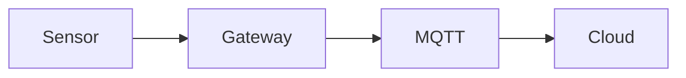

# 本地内容工作台与富文档系统规划

> 版本：v0.4  
> 日期：2026-06-25  
> 状态：分阶段实施中  
> 适用范围：技术文档、项目作品，后续可扩展到个人分享

---

## 1. 决策摘要

我们将建设一个只在本机运行的 **Content Studio（内容工作台）**，用来管理网站中的文档、项目和素材。

核心决策如下：

1. Markdown 继续作为唯一正文源，不引入数据库。
2. GUI 直接读写现有 `docs-vitepress` 和 `public` 目录。
3. GUI 是 Markdown 的操作层，不制造只能由 GUI 读取的私有内容。
4. 主站和 Content Studio 必须复用同一套内容模型与 Markdown 渲染器。
5. 富内容使用“标准 Markdown + 少量结构化内容块”，避免发展成复杂页面搭建器。
6. 工作台仅监听 `127.0.0.1`，不部署到 GitHub Pages，不提供公网管理入口。
7. 第一版优先保证可靠创建、编辑、素材管理、预览和校验，再接入 Git 发布。

期望的最终使用方式：

```bash
npm run studio
```

浏览器打开：

```text
http://127.0.0.1:4174/
```

---

## 2. 背景与现状

### 2.1 当前已经具备的能力

- 文档、项目和个人分享均以 Markdown 文件维护。
- frontmatter 提供标题、摘要、分类、标签、图片等卡片数据。
- `import.meta.glob` 可以自动扫描新增内容。
- `npm run new:doc`、`npm run new:project` 可以生成基础模板。
- `npm run check:content` 可以检查必填字段、重复 ID 和图片路径。
- 主站已经支持标题、列表、表格、引用、代码块和图片预览。
- 主站和 GitHub Pages 已有构建与一键同步命令。

### 2.2 当前维护流程的主要问题

1. 字段填写依赖记忆
   - 用户需要理解 YAML、数组、日期、图片路径和状态字段。
   - 字段拼写错误通常要到构建阶段才会暴露。

2. 图片维护繁琐
   - 需要手动创建目录、重命名文件和复制路径。
   - 封面、图集和正文图片之间没有统一操作界面。

3. 编辑和预览分离
   - 修改 Markdown 后要切回主站查效果。
   - 卡片效果与详情页效果不能同时观察。

4. 富内容能力没有统一协议
   - 图片和 GIF 可以使用，但视频、图表和交互演示没有统一写法。
   - 当前自研 Markdown 解析器继续扩展会逐渐复杂。

5. 内容状态边界不完整
   - 当前 `archived` 会被过滤，但 `draft` 仍可能进入生产网页。
   - 项目的开发阶段和内容的发布状态容易混用。

6. 发布步骤仍然分散
   - 保存、校验、构建、提交和部署需要执行不同命令。
   - 操作失败时，对非开发用户不够直观。

---

## 3. 产品目标

### 3.1 核心目标

让用户不需要手写 YAML、不需要手动管理素材路径，也能可靠完成：

- 新建文档和项目。
- 编辑元数据与 Markdown 正文。
- 上传并插入图片、GIF 和小视频。
- 插入代码、图表、画廊和交互演示。
- 同时预览卡片和详情页。
- 在保存前发现问题。
- 管理草稿、发布和归档状态。
- 最终通过清晰的操作完成提交和上线。

### 3.2 体验目标

- 第一次使用时，不阅读开发文档也能创建一篇合格内容。
- 常规内容更新尽量在一个界面内完成。
- GUI 与网页风格一致，但更偏安静、紧凑的生产工具。
- 所有操作有明确的保存、错误和发布状态。
- 即使 Content Studio 以后停止维护，Markdown 文件仍然可以继续使用。

### 3.3 质量目标

- 不因误操作覆盖原文。
- 不允许写入约定目录之外的文件。
- 内容预览与主站渲染结果保持一致。
- 草稿不会意外进入生产网页。
- 图片、链接和富内容资源在发布前可以被检查。

---

## 4. 用户与主要场景

### 4.1 目标用户

第一阶段只服务站点拥有者本人，属于单用户、本地工具。

不针对：

- 多人协作编辑。
- 企业权限管理。
- 公网内容运营后台。
- 移动端随时发布。

### 4.2 高频场景

#### 场景 A：新建技术文档

1. 点击“新建文档”。
2. 填写标题，系统生成 ID 和日期。
3. 选择分类、难度和标签。
4. 编写正文并插入代码、图片或 Mermaid 图。
5. 查看卡片与详情预览。
6. 保存为草稿或标记为发布。

#### 场景 B：新建项目作品

1. 点击“新建项目”。
2. 填写摘要、技术栈、角色、阶段和亮点。
3. 拖入封面、架构图、成果图和演示 GIF。
4. 调整图集顺序。
5. 在正文中插入视频或交互演示。
6. 检查并发布。

#### 场景 C：更新已有内容

1. 在列表中搜索文档或项目。
2. 修改正文或元数据。
3. 系统自动更新 `updatedAt` 和阅读时长。
4. 查看改动预览与校验结果。
5. 保存并发布。

#### 场景 D：管理素材

1. 打开当前内容的素材面板。
2. 上传图片、GIF、视频或附件。
3. 系统自动规范文件名并生成路径。
4. 设置封面、插入正文或加入图集。
5. 检查未使用素材和失效引用。

---

## 5. 问题边界

### 5.1 第一版必须解决

- 文档和项目的创建、编辑、复制、归档。
- frontmatter 表单化编辑。
- Markdown 编辑与实时预览。
- 图片、GIF、小视频的本地上传和引用。
- 代码块、表格、引用块、Mermaid、画廊和视频渲染。
- 卡片预览与详情页预览。
- 自动保存恢复、显式保存和写入前校验。
- 草稿与生产内容隔离。
- 内容检查与构建状态展示。

### 5.2 第一版明确不做

- 不做类似 Word 的完整所见即所得编辑器。
- 不做自由拖拽页面布局。
- 不做在线数据库、用户系统、登录和权限。
- 不做多人实时协作、评论和审批。
- 不做云端视频转码和流媒体服务。
- 不自动执行不可信脚本。
- 不允许任意 iframe 和任意本地文件路径。
- 不代替 Git，不隐藏真实 Markdown 文件。
- 不以手机端内容编辑为主要目标。

### 5.3 后续可以扩展

- 个人分享内容管理。
- 多级知识库目录和系列文章。
- 全文搜索索引。
- 图片压缩、缩略图和格式转换。
- Lottie、Rive、音频和附件块。
- 内容版本对比和一键回滚。
- 发布历史和站点健康检查。

---

## 6. 内容模型

### 6.1 通用字段

所有内容统一包含：

| 字段 | 说明 | 规则 |
| --- | --- | --- |
| `id` | 路由和唯一标识 | 创建后锁定 |
| `title` | 展示标题 | 必填 |
| `summary` | 卡片摘要 | 必填，建议 40 到 140 字 |
| `status` | 发布状态 | `draft / published / archived` |
| `createdAt` | 创建日期 | 自动生成 |
| `updatedAt` | 更新日期 | 保存时自动更新 |
| `cover` | 封面资源 | 可选 |

### 6.2 技术文档字段

- `category`
- `tags`
- `level`
- `readingTime`
- `views`

`readingTime` 默认根据中英文字符数和代码块长度自动计算，也允许手动覆盖。

### 6.3 项目字段

- `stack`
- `highlights`
- `gallery`
- `links`
- `role`
- `period`
- `projectStage`

项目进度与发布状态分离：

```yaml
status: published
projectStage: maintained
```

`status` 决定网页是否展示，`projectStage` 描述项目处于概念、开发、完成还是维护阶段。

项目还可选用 `presentation`、`narrative`、`visualPreset`、`updatedAt` 和 `currentFocus`。它们默认保持普通项目阅读体验；只有 `presentation: immersive` 时，前端视觉分支才读取这些字段和正文中的叙事围栏，提供局部空间交互。Content Studio 负责填写字段和插入围栏，不负责生成专属 Three.js 场景模块。

建议值：

```text
concept
building
completed
maintained
paused
```

### 6.4 状态规则

| 状态 | Studio | 本地开发主站 | 生产构建 |
| --- | --- | --- | --- |
| `draft` | 显示 | 可选择显示 | 不显示 |
| `published` | 显示 | 显示 | 显示 |
| `archived` | 归档区显示 | 不显示 | 不显示 |

草稿隔离是第一阶段必须先修复的基础能力。

---

## 7. 富文档能力规划

### 7.1 总体原则

富文档由三层组成：

1. 标准 Markdown：保证可移植和可手工维护。
2. 结构化富内容块：覆盖视频、画廊、演示等 Markdown 不擅长的内容。
3. 素材文件：统一存放在 `public`，由 Studio 管理路径。

不在 Markdown 中保存大段生成 HTML，也不保存 GUI 私有 JSON 页面结构。

### 7.2 第一版支持矩阵

| 内容 | 第一版 | 编辑方式 | 展示方式 |
| --- | --- | --- | --- |
| 标题、列表、引用 | 支持 | Markdown 工具栏 | 原生文档样式 |
| 表格、任务清单 | 支持 | 工具栏生成模板 | 响应式表格 |
| 行内代码 | 支持 | 工具栏 | 高对比代码样式 |
| 代码块 | 支持 | 语言选择 + 编辑器 | 高亮 + 复制 |
| 图片 | 支持 | 上传或拖拽 | 图注 + 灯箱 |
| GIF | 支持 | 按图片上传 | 保持动画 |
| 图片画廊 | 支持 | 素材多选和排序 | 网格 + 灯箱 |
| MP4 / WebM | 支持 | 上传 + 属性表单 | HTML5 播放器 |
| Mermaid | 支持 | 图表模板 + 代码编辑 | 懒加载渲染 |
| Callout | 支持 | 类型选择 | note/tip/warning/danger |
| HTML 演示 | 支持 | 选择演示目录 | sandbox iframe |
| 外部视频 | 延后 | URL | 后续白名单嵌入 |
| Lottie / Rive | 延后 | 动画素材 | 后续专用组件 |
| 音频、附件 | 延后 | 上传 | 后续组件 |

### 7.3 标准 Markdown 示例

代码块继续使用标准 fenced code：

````markdown
```c
void app_main(void) {
    printf("Hello");
}
```
````

图片和 GIF 继续使用：

```markdown

```

Mermaid 使用：

````markdown

````

### 7.4 结构化富内容块

为了保持 Markdown 可读，结构化内容使用“特殊代码围栏 + YAML 配置”。

#### 视频

````markdown
```video
src: /videos/edge-gateway/offline-recovery.mp4
poster: /images/projects/edge-gateway/video-poster.jpg
caption: 断网后本地缓存与自动恢复演示
autoplay: false
loop: false
muted: false
```
````

#### 图片画廊

````markdown
```gallery
columns: 2
images:
  - src: /images/projects/edge-gateway/hardware.jpg
    alt: 网关硬件
    caption: 主控与接口板
  - src: /images/projects/edge-gateway/dashboard.png
    alt: 管理界面
    caption: 远程日志界面
```
````

#### Callout

````markdown
```callout
type: warning
title: 注意
content: 修改项目 ID 会导致旧链接失效。
```
````

#### 交互演示

````markdown
```demo
src: /demos/pid-tuning/index.html
title: PID 参数调节演示
height: 520
allowFullscreen: true
```
````

这些内容块仍然是纯文本，即使脱离 Studio 也能理解和修改。

### 7.5 富内容安全边界

- 视频只允许 `public/videos` 和配置过的可信外链。
- 演示只允许 `public/demos` 下的内容。
- iframe 必须启用 `sandbox`，默认禁止弹窗、顶层跳转和表单提交。
- 不允许 Markdown 直接执行任意 `<script>`。
- 外部 iframe 后续通过域名白名单开放。
- 所有资源路径经过规范化和目录越界检查。

---

## 8. 素材管理

### 8.1 目录约定

```text
public/
  images/
    docs/{id}/
    projects/{id}/
  videos/
    docs/{id}/
    projects/{id}/
  demos/
    {id}/
  files/
    docs/{id}/
    projects/{id}/
```

### 8.2 上传行为

拖入素材后，Studio 负责：

- 根据内容类型和 ID 选择目标目录。
- 将文件名转换为小写英文、数字和短横线。
- 遇到同名文件时自动追加后缀，避免覆盖旧素材。
- 自动生成网站可使用的 `/images/...` 或 `/videos/...` 路径。
- 显示文件大小、格式、尺寸和引用状态。
- 提供“设为封面”“加入图集”“插入正文”操作。

### 8.3 文件格式

第一版允许：

```text
图片：jpg jpeg png webp avif svg
动图：gif webp
视频：mp4 webm
文档附件：暂不开放
```

第一版不强制自动压缩：

- 上传时给出尺寸和体积警告。
- GIF 保留原文件，避免破坏动画。
- 视频超过建议大小时提示使用外部托管。
- 图片自动压缩与缩略图生成放到后续阶段。

### 8.4 建议限制

- 普通图片建议不超过 5 MB。
- GIF 建议不超过 15 MB。
- 仓库内短视频建议不超过 30 MB。
- 超过限制仍可保存草稿，但不能直接进入“发布通过”状态。

---

## 9. Content Studio 界面规划

### 9.1 总体布局

采用桌面端三栏工作界面：

```text
内容列表 | 编辑区 | 预览与检查
```

不做营销式首页，启动后直接进入内容管理工作区。

### 9.2 左侧：内容导航

- 文档 / 项目分段切换。
- 搜索标题、ID、标签和摘要。
- 按分类、状态和更新时间筛选。
- 内容列表显示标题、状态和更新时间。
- 新建、复制、归档操作。
- 未保存内容显示状态圆点。

### 9.3 中间：编辑区

上半部分为元数据表单：

- 标题、摘要、分类、标签。
- 难度、状态、项目阶段。
- 技术栈、亮点、链接等可重复字段。

下半部分为 Markdown 编辑器：

- 标题、粗体、列表、引用、表格工具。
- 代码语言选择。
- 图片、GIF、视频、画廊、Mermaid、Callout、Demo 插入入口。
- 拖拽素材到光标位置。
- 自动保存到浏览器草稿。

### 9.4 右侧：预览与检查

使用标签页切换：

- 卡片预览。
- 详情页预览。
- 素材管理。
- 校验问题。

预览必须复用主站渲染器和样式 token，不能单独实现一套近似效果。

### 9.5 顶部操作栏

- 保存。
- 保存为草稿。
- 标记发布。
- 在主站中打开。
- 运行内容检查。
- 构建检查。
- 提交源码。
- 提交并发布。

Git 与发布按钮在后期接入，第一版核心编辑功能完成前不开放。

---

## 10. 技术路线

### 10.1 总体架构

```text
Content Studio Client
        |
        | HTTP API (127.0.0.1 only)
        v
Local Content Server
        |
        +-- Markdown files
        +-- public assets
        +-- validation/build scripts

Shared Content Core
        |
        +-- schema
        +-- frontmatter
        +-- markdown renderer
        +-- rich block renderer
        +-- asset path rules

Main Website
```

### 10.2 推荐目录

```text
tools/
  content-studio/
    server/
      index.mjs
      content-store.mjs
      asset-store.mjs
      command-runner.mjs
    client/
      index.html
      main.ts
      styles.css

src/
  content-core/
    schema.ts
    frontmatter.ts
    markdown.ts
    rich-blocks.ts
    asset-paths.ts
```

主站与 Studio 共同调用 `src/content-core`，逐步替换目前分散在 `frontmatter.ts`、`documentView.ts` 和检查脚本里的重复逻辑。

### 10.3 前端技术

保持 Vite + TypeScript，不引入 React/Vue。

新增建议：

| 工具 | 用途 | 选择原因 |
| --- | --- | --- |
| CodeMirror 6 | Markdown/代码编辑器 | 可扩展、键盘体验好 |
| markdown-it | Markdown 解析 | 插件和规则扩展成熟 |
| gray-matter | frontmatter 分割 | 替代正则手工拆分 |
| yaml | YAML 解析与生成 | 避免字段转义错误 |
| Mermaid | 图表 | 文本可维护、适合技术文档 |
| highlight.js | 代码高亮 | 可按语言精简引入 |

视频第一版使用原生 HTML5 `<video>`，暂不引入播放器库。后续确认需要统一皮肤、字幕和章节时再评估 Plyr。

### 10.4 本地服务

使用 Node.js 原生 HTTP 或轻量服务层，不引入数据库。

建议 API：

```text
GET    /api/content
GET    /api/content/:type/:id
POST   /api/content/:type
PUT    /api/content/:type/:id
POST   /api/content/:type/:id/archive
POST   /api/assets/:type/:id
DELETE /api/assets/:type/:id/:name
POST   /api/validate
POST   /api/build
POST   /api/publish
```

服务必须：

- 只监听 `127.0.0.1`。
- 校验所有路径仍位于允许目录。
- 使用临时文件 + 原子替换保存 Markdown。
- 保存前创建短期备份。
- 同一内容写入时加锁，避免双窗口覆盖。
- 返回结构化错误，不把终端原始报错直接堆给用户。

### 10.5 自动恢复

- 编辑中的正文每 2 到 5 秒写入浏览器 IndexedDB。
- 明确区分“自动恢复草稿”和“已写入磁盘”。
- 重新打开内容时，如果恢复草稿比磁盘新，提示选择恢复或丢弃。
- 成功保存后清理对应恢复草稿。

---

## 11. Markdown 渲染器迁移

### 11.1 当前问题

当前 `renderMarkdownDocument()` 是自研轻量解析器，已经能支持基础结构，但继续加入任务列表、嵌套列表、富内容块和代码高亮会增加维护成本。

### 11.2 迁移策略

不一次性删除旧渲染器，采用两步迁移：

1. 建立共享 `content-core/markdown.ts`。
2. 使用 markdown-it 覆盖现有基础语法。
3. 为 Mermaid、video、gallery、callout、demo 注册 fence 规则。
4. 对现有所有 Markdown 生成快照，检查渲染差异。
5. 主站与 Studio 切换到共享渲染器。
6. 确认无回归后移除旧 `renderBlock()` 逻辑。

### 11.3 兼容要求

迁移后必须继续支持当前文件：

- 原有标题和目录 ID。
- 图片路径 base 处理。
- 表格、引用和代码块。
- 文档目录生成。
- 图片灯箱。
- GitHub Pages `/embedded-blog/` 路径。

---

## 12. 校验体系

### 12.1 保存前即时校验

- 必填字段。
- ID 格式和重复 ID。
- 标题、摘要长度。
- 标签和列表空值。
- 图片、视频和 Demo 路径。
- 不允许的外部 URL。
- 富内容块 YAML 格式。
- Mermaid 语法。
- 重复封面和无效图集项。

### 12.2 发布前完整校验

- `npm run check:content`
- TypeScript 检查。
- 主站生产构建。
- 草稿未进入生产索引。
- 所有本地资源存在。
- 页面无重复 heading ID。
- Demo iframe 目录和入口存在。
- 视频格式与体积符合发布规则。

### 12.3 错误等级

| 等级 | 行为 |
| --- | --- |
| Error | 禁止发布 |
| Warning | 允许保存，发布前需确认 |
| Suggestion | 不阻塞，仅提供优化建议 |

---

## 13. 发布流程

### 13.1 第一阶段

Studio 只负责保存和校验，发布仍使用终端：

```bash
git add .
git commit
git push
npm run sync:gh-pages
```

### 13.2 后续 GUI 发布

加入发布面板后，流程必须可见：

1. 检查工作区改动。
2. 运行内容校验。
3. 运行生产构建。
4. 展示将要提交的文件。
5. 用户输入提交信息。
6. 提交并推送 `main`。
7. 同步 `gh-pages`。
8. 验证线上入口资源。

发布是高风险操作，必须由用户明确点击确认，不能自动后台执行。

---

## 14. 分阶段规划

### 阶段 0：内容基础统一

目标：先建立可靠底座，不开始做大量 GUI。

任务：

- 统一 `status` 语义。
- 增加 `projectStage`。
- 修复生产环境草稿过滤。
- 引入 `yaml` 和 `markdown-it`；Frontmatter 边界保持轻量，不额外引入 `gray-matter`。
- 建立共享 schema 和 Markdown 渲染器。
- 给富内容块确定稳定语法。

验收：

- 现有内容无渲染回归。
- `draft` 不进入生产构建。
- 主站和 VitePress 均能构建。
- 富内容解析有自动测试。

截至 2026-06-11，阶段 0 已完成：

- 三类内容统一使用 `draft / published / archived`。
- 项目增加 `projectStage`。
- 本地可预览草稿，生产构建只包含已发布内容。
- YAML 与 Markdown 解析收敛到 `src/content-core`。
- 代码块、视频、画廊、提示块、演示和 Mermaid 语法具有稳定解析边界。
- 内容检查、内容核心测试、主站构建和 VitePress 构建均通过。

阶段 1 第一条纵向切片也已完成：

- `npm run studio` 启动只监听 `127.0.0.1:4174` 的本地工作台。
- 本地 API 可扫描三类 Markdown、读取详情并拒绝非法类型和路径。
- 三栏界面支持内容切换、搜索、状态筛选、字段查看、详情预览和基础检查。
- 预览复用 `src/content-core/markdown.ts` 与现有文档样式。

阶段 1 第二条纵向切片已完成：

- Content Studio 进入可编辑模式，支持常用 frontmatter 字段和 Markdown 正文编辑。
- 保存接口使用 `PUT /api/content/:type/:id`，写入前校验内容类型、ID、必填字段和正文非空。
- 保存时使用浏览器草稿、磁盘备份、临时文件和原子替换，降低误操作和半写入风险。
- 同一篇内容保存时有本地写锁，保存前会检查 `modifiedAt`，避免覆盖其他窗口或编辑器已经改过的文件。
- 保存成功后清理浏览器草稿，并返回备份路径，方便必要时人工恢复。
- 已补充保存成功与冲突拒绝的自动化测试。

阶段 1 第三条纵向切片已完成：

- Content Studio 顶部新增“新建”入口，可以创建技术文档、项目作品和个人分享草稿。
- 新建接口使用 `POST /api/content/:type`，创建前校验类型、标题、ID 和重复内容。
- 新草稿会写入对应 `docs-vitepress` 目录，并自动创建 `public/images/{type}/{id}/.gitkeep` 素材目录。
- 新建成功后工作台自动切换到对应类型、选中新草稿并打开编辑器。
- 已补充新建成功、素材目录创建和重复 ID 拦截测试。

阶段 2 第一条纵向切片已完成：

- Content Studio 右侧新增“素材”标签页，可以查看当前内容的图片和视频素材。
- 新增 `GET /api/assets/:type/:id` 和 `POST /api/assets/:type/:id`，素材写入限制在 `public/images` 与 `public/videos` 目录内。
- 支持上传 jpg、jpeg、png、webp、avif、svg、gif、mp4 和 webm；图片/GIF 限制 15MB，小视频限制 30MB。
- 上传时自动规范文件名，遇到同名文件自动追加后缀，不覆盖已有素材。
- 图片/GIF/SVG 可一键插入 Markdown 正文；MP4/WebM 可一键插入 `video` 富内容块。
- 项目图片可一键加入 `gallery`，并进入浏览器草稿状态，保存后写回 Markdown。
- 已补充图片上传、重复命名、视频目录和不支持扩展名拒绝测试。

阶段 2 第二条纵向切片已完成：

- 新增 `DELETE /api/assets/:type/:id`，只允许删除当前内容素材目录内的文件。
- 素材卡片新增“设为封面”和“删除”操作。
- 项目图片设为封面时会移动到 `gallery` 第一位；个人分享图片设为封面时会写入 `cover`。
- 项目素材页新增图集管理器，可以上移、下移和移除图集项。
- 删除素材时会同步清理项目图集或个人分享封面字段，但正文 Markdown 引用仍需要人工确认。
- 已补充素材删除和跨目录删除拒绝测试。

阶段 2 第三条纵向切片已完成：

- Markdown 编辑区新增快捷工具栏，可插入标题、列表、任务、代码块、提示块、表格和视频块模板。
- 支持把图片、GIF、SVG、MP4 或 WebM 直接拖到 Markdown 编辑区。
- 拖拽文件会先上传到当前内容素材目录，再自动在光标位置插入图片语法或 `video` 富内容块。
- 素材文件上传立即写入 `public`，正文引用仍进入浏览器草稿，保存后写回 Markdown。
- 完整 CodeMirror 编辑器仍作为后续增强项，当前先保持轻量、稳定、容易维护。

阶段 2 第四条纵向切片已完成：

- 顶部新增“预览差异”入口，只在存在浏览器草稿时可用。
- 差异弹窗按 Frontmatter 和 Markdown 分区展示行级新增与删除。
- 差异弹窗支持“继续编辑”和“保存这些修改”，保存成功后会同步更新磁盘快照。
- 内容列表测试改为使用临时夹具，不再依赖真实内容中必须存在 archived 项。

### 阶段 1：Content Studio MVP

目标：可以不用手写 YAML 完成文档和项目维护。

任务：

- 内容列表、搜索、筛选。
- 新建、编辑、保存、复制、归档。
- 元数据表单。
- Markdown 快捷工具栏。
- CodeMirror Markdown 编辑器（后续增强）。
- 浏览器恢复草稿。
- 保存前差异预览。
- 卡片与详情实时预览。
- 即时字段校验。

验收：

- 可以从空白创建一篇技术文档。
- 可以编辑现有项目并保存回原 Markdown。
- ID 不可误改。
- 刷新浏览器后未保存内容可恢复。
- GUI 预览与主站效果一致。

### 阶段 2：富内容与素材

目标：覆盖真实项目和技术教程所需的多媒体内容。

任务：

- 图片、GIF、视频上传。
- 封面设置和图集排序。
- 正文拖拽插图。
- Markdown 快捷插入。
- 代码高亮与复制。
- Mermaid、Callout、Gallery、Video、Demo。
- 素材引用与失效检查。

验收：

- 一篇内容可同时包含代码、图片、GIF、视频和 Mermaid。
- 图集可排序，图片可灯箱查看。
- 视频可播放且移动端不溢出。
- Demo 在 sandbox iframe 中运行。
- 删除被引用素材时会被阻止或警告。

### 阶段 3：检查与发布

目标：从编辑到上线形成完整闭环。

任务：

- 内容检查面板。
- 构建日志。
- Git 改动预览。
- 提交信息输入。
- 推送 main 和同步 gh-pages。
- 线上资源验证。

验收：

- 发布失败时保留内容和清晰错误信息。
- 发布前能看到具体变更文件。
- 发布完成后能验证线上资源版本。
- 不会因 Studio 操作丢失未提交修改。

### 阶段 4：增强能力

- 个人分享管理。
- 多级知识库树。
- 版本差异与恢复。
- 图片优化。
- Lottie/Rive。
- Pagefind 全文搜索。
- 内容模板库。

---

## 15. 第一版页面清单

第一版只做一个主工作区，不增加多余页面：

1. 内容列表与筛选。
2. 文档/项目编辑器。
3. 素材抽屉。
4. 卡片/详情预览。
5. 校验结果面板。
6. 新建内容对话框。
7. 归档确认对话框。

发布面板属于阶段 3。

---

## 16. 验收用例

第一版完成时至少通过以下真实用例：

1. 创建中文标题文档，自动生成稳定英文 ID。
2. 添加带引号、冒号和特殊字符的摘要，YAML 不损坏。
3. 添加多个标签、技术栈、亮点和链接。
4. 拖入中文文件名图片，自动规范命名并插入正文。
5. 上传 GIF 后保持动画。
6. 插入 C/C++ 代码块并正确高亮、复制。
7. 插入 Mermaid 架构图并在预览和主站一致显示。
8. 上传 MP4，设置 poster 和 caption。
9. 插入一个本地 HTML 演示并在 sandbox 中运行。
10. 刷新 Studio 后恢复未保存正文。
11. 保存时发现重复 ID 和丢失图片。
12. 草稿在 Studio 可见，但生产构建中不可见。
13. 归档内容后文件仍存在且可恢复。
14. 直接手工修改 Markdown 后，Studio 能重新读取。
15. Windows 路径、中文目录和 GitHub Pages base path 均正常。

---

## 17. 风险与应对

### 风险 1：GUI 与 Markdown 双向转换损坏内容

应对：

- frontmatter 使用成熟 YAML 库。
- 正文保持原始 Markdown 字符串，不转成私有 JSON。
- 保存前显示 diff。（已完成基础行级 diff）
- 使用原子写入和备份。

### 风险 2：富内容协议不断膨胀

应对：

- 第一版只开放五种结构化块。
- 每种块有明确 schema。
- 不支持任意自定义 HTML。

### 风险 3：素材使仓库过大

应对：

- 上传时显示体积警告。
- 对视频设置仓库内建议上限。
- 大视频后续使用外部托管。
- 定期提供未引用素材检查。

### 风险 4：预览与线上不一致

应对：

- 主站与 Studio 复用渲染器和样式。
- 发布前运行生产构建。
- 保留关键文档的渲染快照测试。

### 风险 5：本地服务具有文件写入能力

应对：

- 仅绑定 `127.0.0.1`。
- 启动时生成临时会话令牌。
- 严格限制可写目录。
- 拒绝 `..`、绝对磁盘路径和符号链接越界。
- 发布操作再次确认。

---

## 18. 开工顺序

正式实施时按以下顺序进行：

1. 统一内容状态和字段 schema。
2. 建立共享 Markdown 渲染核心。
3. 为富内容块补解析器和测试。
4. 建立本地内容 API。
5. 做 Content Studio 三栏界面。
6. 接入素材管理。
7. 接入真实主站预览。
8. 完成校验体系。
9. 最后接入 Git 和发布。

不要先从漂亮的编辑器界面开始。只有内容模型、渲染器和文件安全稳定后，GUI 才能真正降低维护成本。

---

## 19. 当前结论

这个方案可以支持丰富的技术文档和项目案例，包括：

- 大段技术正文。
- 多语言代码和复制。
- 图片、GIF、图集。
- MP4/WebM 演示视频。
- Mermaid 架构图、流程图和时序图。
- 提示块和工程结论。
- 独立 HTML/Canvas/WebGL 交互演示。

同时保留三个底线：

1. 内容仍然是可手工维护的 Markdown。
2. 主站仍然是可部署到 GitHub Pages 的静态网站。
3. Content Studio 只负责提升本地维护效率，不把项目改造成复杂 CMS。
